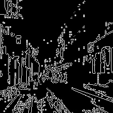
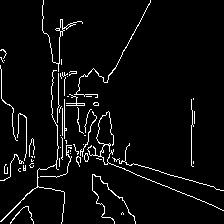
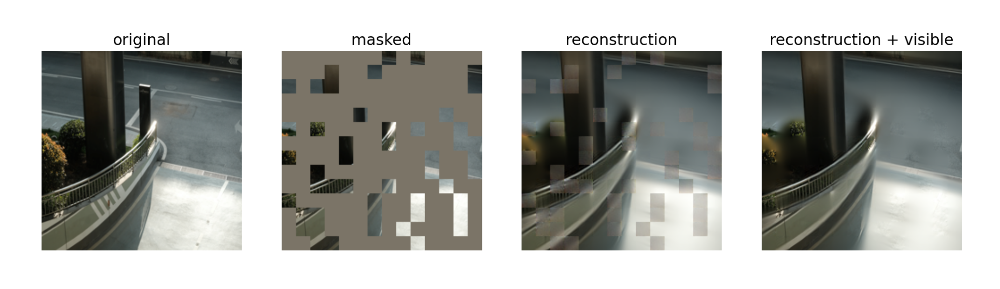
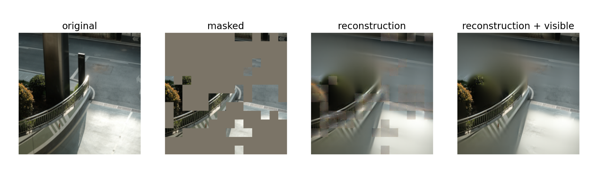

# 整体思路

MaskedAutoencoders(MAE)是何恺明教授在21年末提出的一种无监督学习模型，它可以恢复被遮盖的图像.语义通信是近年发展较快的一个通信方向.是以任务为主体,先理解再传输的通信方式.

本项目的创新点在于MAE强大的图像压缩能力(75%)与语义通信相结合,可以在一个较高可靠性的基础上大幅增加信道利用率.

这里需要设计一个过滤算法来提高其通信可靠度.目的是确保图像中的关键部分(eg.人,车等)被传输,而图像中不关键的部分(eg.天空)被遮盖.

值得一提的是,这里的关键部分针对不同的任务是不同的.

# 算法实现

主要实现代码在models_mae_eval.py文件中,一些结果图在data文件夹下.

该算法的输入包括两个部分,其一是下游任务的类型(以图像分类算法为例),其二是被传输的图片.

## 图像分类任务的过滤算法

首先下游任务的类型是图像分类,我主要根据两个特征来进行筛选.

- 小尺度特征:物体纹理,物体边缘->由opencv库里的canny算法实现

- 大尺度特征:主要是物体轮廓->由轻量语义分割模型实现(后期可用其他费时更少的算法替代)

  

这二者之间的比重由超参α决定.

对两份特征图进行标准化,归一化处理,然后进行softmax,给出概率分布.

给定一个采样数,根据选中次数生成一个掩码序列,根据掩码长度和掩码比例分别给出两份掩码.(掩码长度跟MAE模型中patch数相关)

根据超参α,先取αL大尺度掩码,因为这两份掩码会有一样的部分,这里还需要去重处理.将小尺度掩码中与大尺度掩码中一样的去除,然后按序(降序)取(1-α)L的小尺度掩码.

这样整个过滤算法就完成了.

- 未使用过滤算法

- 使用过滤算法

## 其他下游任务的过滤算法

拿视觉方案的自动驾驶举例,在此任务中,行人,各种车辆,道路优先值都是非常高的,我们需要对大尺度的特征图进行赋值处理,因为其是由语义分割得到,他在分割时就已经判断过物体类型了,在此时给高价值目标更高的像素值即可.除此之外,还可以对超参α进行修改.

# 总结

算法基本目标已经初步实现,能够在一个较高可靠性的基础上大幅增加信道利用率.
